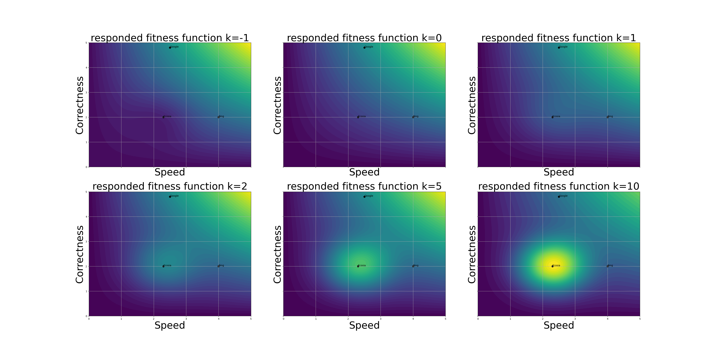

# An Extension of our Formalism: Search Engine Regulation

Suppose there are 3 search engines: Google, Bing, and Ecosia. We gather a large collection of user ratings for each based on two 
characteristics: speed and correctness. Each engine therefore has a coordinate (speed, correctness):
- Google = (2.5, 4.8)
- Bing = (4.0, 2.0)
- Ecosia = (2.3, 2.0)

Assume the market share is originally in Google's favor (80%, 15%, 5% respectively?)

Suppose a new user wants to choose which search engine to use. They value both speed and correctness, so 
they decide the product of speed and correctness, m(x,y) = xy, is a good indicator of the quality of the search engine.
Clearly, Google is the best based on this:
- 2.5 * 4.8 = 12
- 4.0 * 2.0 = 8
- 2.3 * 2.0 = 4.6

We can create a game to represent this decision by thinking about the user playing a 2-player game. 
First, we want to characterize a "better" engine based on the product:

| |G|B|E|
|---|---|---|---|
G|1, 1|1,0|1,0
B|0, 1|1, 1|1,0
E|0, 1|0, 1| 1, 1  

This fails to capture that, in reality, Google is "fitter". So, a better way to decide the payoffs is based off of their relative scores:

| |G|B|E|
|---|---|---|---|
G|12, 12|12, 8|12, 4.6
B|8, 12|8, 8|6, 4.6
E|4.6, 12|4.6, 8| 4.6, 4.6  

You can think of this is as the payoff of using the row search engine at one timestep and the column engine in the next. Here, (Google, Google) is a unique Nash, as Google dominates other strategies. 

Now, suppose the government wants to promote green search engines like Ecosia. 
The government doesn't have access to the scoring function (speed * correctness) but they do know
the coordinates of each search engine but not small companies like Ecosia. Suppose we define a new function fLAW
that uses the coordinates of Ecosia and an arbitrary scale factor k. 

In the image below, we observe the effect of several  k if fLAW takes the form
 
fLAW(x,y) = ke1-(x-xe)2-(y-ye)2
 

Note that the contours represent the new fitness m(x,y) + fLAW(x,y), and recall
x and y denote speed and correctness for the search engine. 

Now, a new user would want to switch to Ecosia, so the market share of Ecosia increases at the expense of both Bing and Google, at a rate proportional 
to their relative fitness per week. The government chooses k=2 because Republicans will be really angry if the government regulates more than that.

Next week, suppose a new search engine wants to enter the fray. They don't know a lot about either m(x,y) or fLAW, but say they 
see a spike in Ecosia's profits and understand that, in general, the dynamic is in favor of Ecosia. 
The new search engine, Sameersearch, is going to rip off Ecosia's techology but also secretly collect user data to improve correctness. 
While the government doesn't like this either, the government has to choose between promoting Ecosia's green model and Sameersearch's infringements.
Sameersearch has coordinates (2.5, 2.2), right in the next contour, while ensuring Republicans don't get mad. 

TODO: Multi-stage game: how does the government make a new law to prevent Sameersearch from ripping user data (correctness) but?
